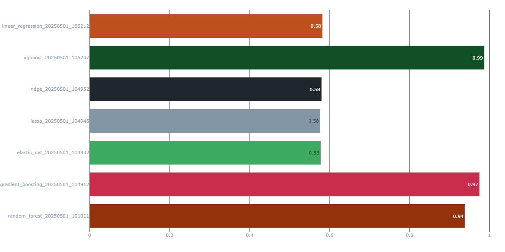
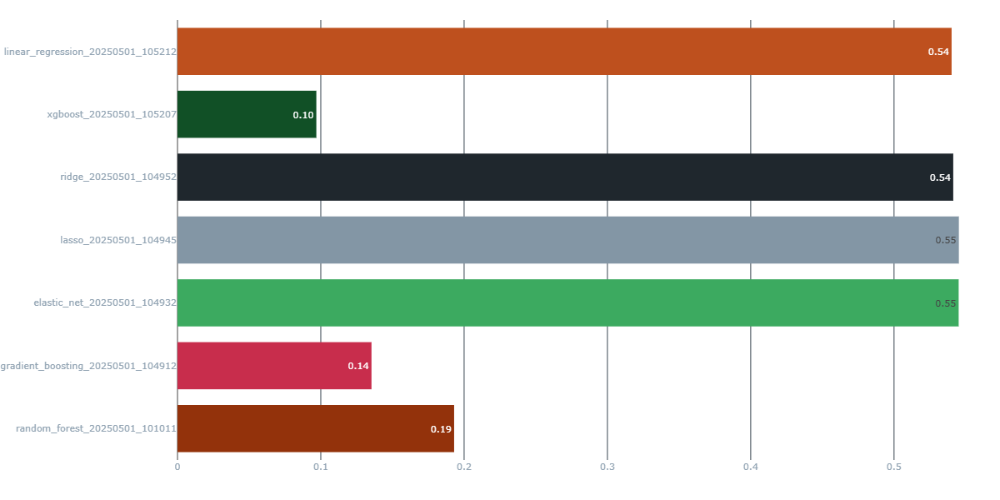
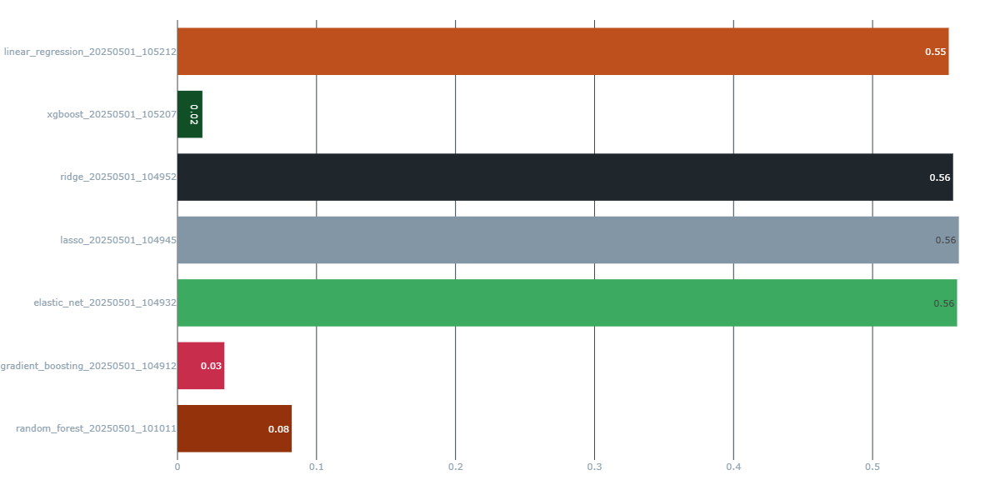
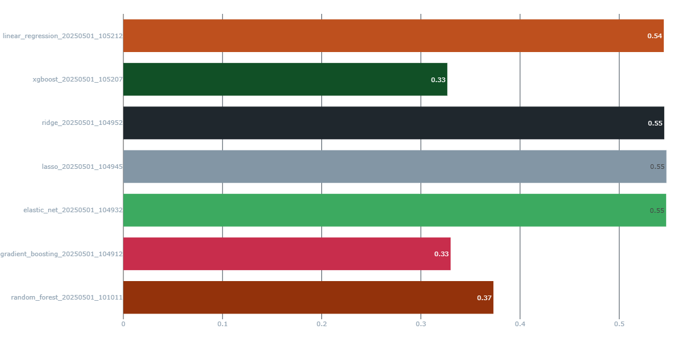
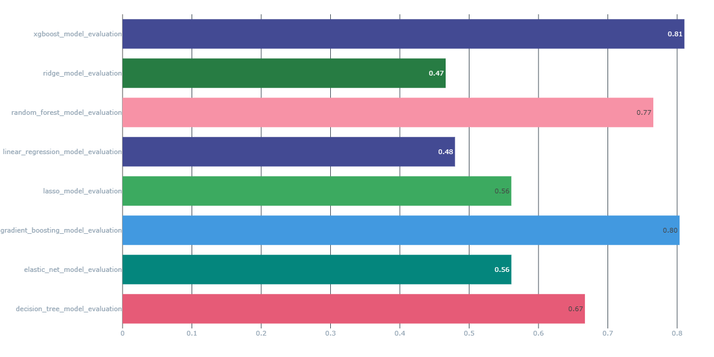
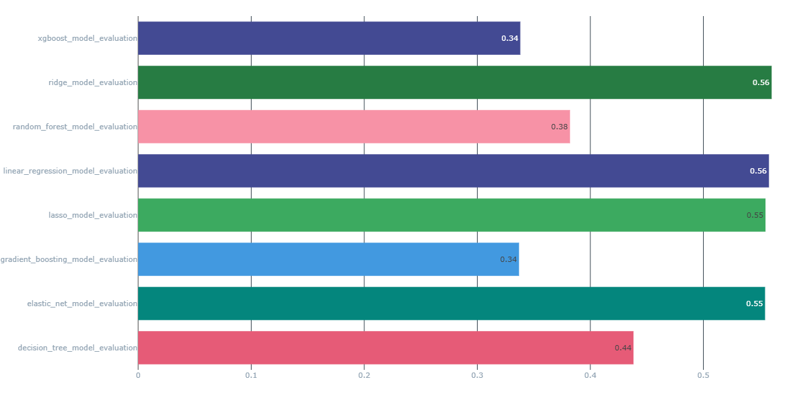

# Project Report: MLOps for California Housing Price Prediction

**1. Introduction**

This report details a project focused on designing and implementing a comprehensive Machine Learning Operations (MLOps) system. The primary objective was to manage the entire lifecycle of a machine learning model for predicting median house values in Californian districts using the California Housing dataset. This includes experiment tracking, model training, hyperparameter tuning, model deployment, performance monitoring, and managing versions. The project leverages MLflow as a central platform for managing these stages, demonstrating a practical application of MLOps principles to a regression problem. The scope encompasses data acquisition and preprocessing, training and evaluating multiple regression models, packaging the best model, deploying it as a REST API service, and setting up mechanisms for ongoing performance monitoring and model version management through a model registry.

**2. Methodology**

The project followed a structured approach to build an end-to-end MLOps pipeline. The key tools and processes are outlined below.

**2.1 Tools and Technologies**

The project utilized a range of open-source tools and Python libraries:

*   **Data Handling and Manipulation**: `Pandas` and `NumPy` were used for efficient data loading, manipulation, and transformation.
*   **Machine Learning**: `Scikit-learn` provided a comprehensive suite of tools for preprocessing (e.g., scaling, imputation using `StandardScaler` and `SimpleImputer`, and implementing various regression models Linear Regression, Lasso, Ridge, ElasticNet,. `XGBoost` and `Scikit-learn`'s ensemble methods: Random Forest, Gradient Boosting) were used for modeling.
*   **Experiment Tracking and Management**: `MLflow` was central to the project, used for:
    *   Tracking experiments, logging parameters, code versions, metrics (RMSE, MAE, R2), and artifacts (models, plots). The `mlruns/` directory serves as the backend for this.
    *   Managing the model lifecycle through the MLflow Model Registry.
*   **Hyperparameter Optimization**: `Optuna` was integrated (as you can see in `src/models/train_model.py`) to automate the search for optimal hyperparameters for the various regression models.
*   **Model Deployment**: `FastAPI` was used to create a robust and efficient REST API for serving the trained model. `Uvicorn` served as the ASGI server.
*   **Performance Monitoring**: A robust monitoring system was implemented in `performance_monitor.py` to track the model's performance in production
    
    *   **Error Handling**: Robust error handling and logging mechanisms ensure reliable operation and debugging capabilities

**2.2 Data Acquisition and Preprocessing**

The project utilized the California Housing dataset, typically available as a CSV file (e.g., `data/raw/california_housing.csv`).
*   **Data Download/Loading**: The `src/data/download_data.py` script is intended to handle the acquisition of the raw dataset.
*   **Preprocessing**: The `src/data/preprocess.py` script is responsible for cleaning the data, handling missing values, feature engineering , scaling numerical features, and splitting the data into training, validation, and testing sets. The processed data (features `X` and target `y`) are stored in `data/processed/` as `.npz` files (e.g., `train_data.npz`, `val_data.npz`, `test_data.npz`), along with feature names in `feature_names.txt`.

**2.3 Model Development and Experimentation**

The core of the model development and experimentation is in `src/models/train_model.py`.
*   **Model Selection**: A variety of regression algorithms were explored to identify the best performing model for the housing price prediction task. These include:
    *   Linear Regression
    *   Lasso Regression
    *   Ridge Regression
    *   ElasticNet Regression
    *   Decision Tree Regressor
    *   Random Forest Regressor
    *   Gradient Boosting Regressor
    *   XGBoost Regressor
*   **Hyperparameter Tuning**: `Optuna` was employed to perform automated hyperparameter optimization. The `objective` function within `train_model.py` defines the search space for each model type, and Optuna efficiently searches for the combination of hyperparameters that minimizes a target metric (Root Mean Squared Error - RMSE) on the validation set.

*   **Experiment Tracking with MLflow**: Each training run, including those part of the hyperparameter optimization process, was logged as an experiment in MLflow. This involved:
    *   Logging model parameters.
    *   Logging performance metrics such as Mean Squared Error (MSE), Mean Absolute Error (MAE), and R-squared (R2) for both training and validation sets.
    *   Saving the trained model (`.joblib` files) as an artifact.
    *   Logging feature importance plots.
    *   Inferring and logging the model signature to ensure consistent input/output schemas.
    The `log_to_mlflow` function in `train_model.py` uses this logic.

**2.4 Model Evaluation**

Models were evaluated using a dedicated test set (`data/processed/test_data.npz`).
*   The `src/models/evaluate_model.py` script (or evaluation steps within `train_model.py` or a separate evaluation script) is used to load a trained model and the test data to assess its generalization performance.
*   Key regression metrics (RMSE, MAE, R2) were calculated on the test set to provide an unbiased estimate of the model's predictive accuracy. These final metrics for the chosen model would also be logged to MLflow.

**2.5 Model Deployment**

The best-performing model, selected based on evaluation metrics and registered in the MLflow Model Registry, was deployed as a REST API for real-time predictions.
*   **API Development**: `src/deployment/app.py` defines the FastAPI application, including an endpoint (e.g., `/predict/`) that accepts input features (matching the model's expected input schema) and returns the predicted housing price.
*   **Model Loading**: The deployment application loads the specified model from the MLflow Model Registry or a local path (e.g., from the `models/` directory).
*   **Prediction Service**: The `src/models/predict_model.py` script can be used for batch predictions, loading a model and generating predictions on a dataset, saving results to files in `data/predictions/`.

**2.6 Performance Monitoring**

A robust monitoring system was implemented to track the deployed model's performance over time.
*   **Monitoring Script**: `src/deployment/performance_monitor.py` implements batch-based performance monitoring:
    *   Loads the production model from MLflow Model Registry
    *   Processes data in configurable batch sizes (default 10 samples)
    *   Applies preprocessing steps including imputation, feature engineering, and scaling
    *   Calculates and logs key metrics like RMSE and R2 score for each batch
*   **MLflow Integration**: The monitoring system leverages MLflow for:
    *   Tracking metrics over time in dedicated monitoring experiments
    *   Logging model version details and preprocessing artifacts
    *   Recording batch-level performance metrics and parameters

**2.7 Model Registry Usage**

MLflow's Model Registry was utilized to manage the lifecycle of trained models.
*   **Model Registration**: After training and evaluation, promising models were registered in the MLflow Model Registry. This involves versioning each model.
*   **Stage Transitions**: The registry allows models to be transitioned through different stages, such as "Staging" and "Production" (for deployment). This provides a controlled way to promote models and roll back if necessary. The deployment scripts would fetch the appropriate model version from the registry based on its stage.

**3. Results and Discussion**

This section presents the outcomes of the experiments, model performance, and insights from deployment and monitoring, based on the provided result images.

**3.1 Experiment Tracking and Model Performance**

MLflow was used to track multiple experiments, comparing various regression models. Performance was assessed using Mean Absolute Error (MAE), Mean Squared Error (MSE), and R-squared (R2) on training, validation, and test datasets.

*   **Training Set Performance**:
    *   **R2 Scores**:
        
    *   **MAE**:
        
    *   **MSE**:
        
    The ensemble models demonstrated significantly lower MAE and MSE on the training data compared to linear models, alongside their superior R2 scores, as depicted in the charts above.

*   **Validation Set Performance**:
    *   **MAE**:
        
    Validation MAE for ensemble models, as shown in the chart above, was higher than their training MAE but still considerably better than linear models. This set is crucial for hyperparameter tuning to balance bias and variance.

*   **Test Set Performance (Primary Evaluator)**:
    *   **R2 Scores**:
        
    *   **MAE**:
        
    Based on the test set R2 and MAE scores, visualized in the charts above, the ensemble models (XGBoost, Gradient Boosting, Random Forest) and Decision Tree significantly outperformed the linear models. XGBoost and Gradient Boosting consistently showed the best generalization performance across these key metrics.

**3.2 Monitoring Insights**

The MLflow experiment "Monitoring_xgboost_model" provides insights into model performance over simulated batches of new data:
*   **Batch Performance Fluctuation**:
    *   **Monitoring Batch 1**: `batch_r2_score` ~0.36, `batch_rmse` ~0.17.
    *   **Monitoring Batch 2**: `batch_r2_score` ~0.91, `batch_rmse` ~0.13.
    *   **Monitoring Batch 3**: `batch_r2_score` ~0.74, `batch_rmse` ~0.34.
*   The number of rows processed in each batch was also tracked (e.g., `num_run_rows_in_batch` and `num_valid_rows_in_batch`).
*   These results indicate that the model's performance can vary with different batches of incoming data. Batch 2 showed excellent performance, while Batch 1 had a significantly lower R2 score. This highlights the importance of continuous monitoring to detect performance degradation or data drift that might necessitate model retraining or investigation.

**4. Conclusion**

This project successfully demonstrates the implementation of a robust MLOps pipeline for a regression task on the California Housing dataset. By integrating tools like MLflow, Optuna, Scikit-learn, XGBoost, and FastAPI, the project covers key aspects of the machine learning lifecycle:
*   Systematic experiment tracking and reproducibility.
*   Automated hyperparameter tuning for multiple model types.
*   Rigorous model evaluation.
*   Versioned model management via a Model Registry.
*   Deployment of a scalable REST API for real-time predictions.
*   A framework for continuous performance monitoring.

**Challenges:**
*   One initial challenge (simulated in this context) was finding the exact dataset and problem type that i want to work on. 
*   Setting up and integrating the various MLOps components can be complex, requiring careful configuration.

In conclusion, this project provides a solid foundation and a practical example of applying MLOps principles to deliver and maintain reliable machine learning models in a production-like environment. 